## Case Study – CDC, Debezium, Kafka based Customer Notifications

<p align="center">
    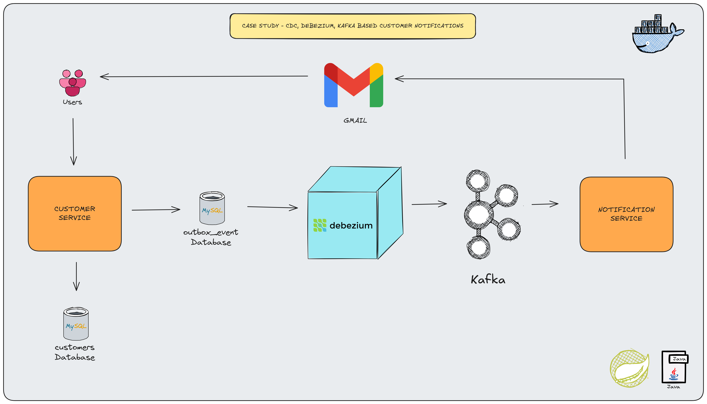
</p>

### 📖 Information

### Project Definition (Customer Service + CDC Outbox + Notification Service)

* A **Customer Service** exposes REST APIs to manage customers (create, update, delete, read).  
Each change on a customer creates a corresponding **Outbox Event** in the database.

* A **Debezium CDC connector** listens to the outbox table and publishes events to a **Kafka topic**.  
A separate **Notification Service** consumes these events from Kafka and sends **email notifications** using `JavaMailSender`.

* You can trace and debug the event flow by using **Kafdrop** running on **Docker** at [http://localhost:9090](http://localhost:9090)
  browse topics (e.g. **customerdb.outbox_event**), inspect partitions, and view individual messages produced from the outbox table.

* This demonstrates the **Transactional Outbox Pattern** with **CDC (Change Data Capture)** via **Debezium** and **Kafka**.

### 🔍 How Debezium Reads Outbox Events

The Debezium MySQL connector does **not** poll the outbox table directly.  
Instead, it connects to MySQL **like a replica** and reads changes from the **MySQL binary logs (binlog)**:

1. The application performs an `INSERT` into the **outbox table** (e.g. `outbox_event`) within the same local transaction as the business change (customer create/update/delete).
2. MySQL writes this `INSERT` operation to its **binary log (binlog)**.
3. The **Debezium MySQL connector** tails the binlog and **sees the insert event** for the outbox table.
4. Based on the connector configuration (e.g. `database.include.list`, `table.include.list`), Debezium **filters for the outbox table events**.
5. Debezium then **publishes these events to Kafka** (for example, to the `customerdb.outbox_event` topic).
6. The **Notification Service** consumes the Kafka message and triggers the corresponding **email notification**.

In summary, **the true data source for Debezium is the MySQL binlog**, while the **outbox table** is the *logical* source of domain events your services write to.

---

### Explore Rest APIs

Endpoints Summary

| Method | URL | Description | Request Body | Headers/Path | Response | Status Codes |
| :--- | :--- | :--- | :--- | :--- | :--- | :--- |
| POST | `/customers` | Create a new customer and emit `CUSTOMER_CREATED` outbox event. | **JSON:** <ul><li>`CreateCustomerRequest` (e.g. `email`, `firstName`, `lastName`)</li></ul> | Headers: `Content-Type: application/json`, `Accept: application/json` | `Customer` (created customer) | `201 Created`, `400 Bad Request`, `500 Internal Server Error` |
| PUT | `/customers/{id}` | Update an existing customer and emit `CUSTOMER_UPDATED` outbox event. | **JSON:** <ul><li>`UpdateCustomerRequest` (e.g. `email`, `firstName`, `lastName`)</li></ul> | Path: `id` = customer id<br>Headers: `Content-Type: application/json`, `Accept: application/json` | `Customer` (updated customer) | `201 Created`, `400 Bad Request`, `404 Not Found`, `500 Internal Server Error` |
| DELETE | `/customers/{id}` | Delete a customer and emit `CUSTOMER_DELETED` outbox event. | – | Path: `id` = customer id<br>Headers: `Accept: */*` (optional) | Empty body | `200 OK`, `404 Not Found`, `500 Internal Server Error` |
| GET | `/customers/{id}` | Get a customer and emit `CUSTOMER_READ` outbox event. | – | Path: `id` = customer id<br>Headers: `Accept: application/json` | `Customer` (requested customer) | `200 OK`, `404 Not Found`, `500 Internal Server Error` |

### Technologies

* Java 25
* Spring Boot 3.0
* Restful API
* Maven
* Junit5
* Mockito
* Integration Tests
* Docker
* Docker Compose
* Postman
* Apache Kafka
* Debezium
* Kafdrop
* JavaMailSender (Gmail)

-----

### Postman

```
Import postman collection under postman_collection folder
```

-----

### Prerequisites

#### Define Variable in .env file

```
CUSTOMER_SERVICE_DB_IP=localhost
CUSTOMER_SERVICE_DB_PORT=3307
DATABASE_USERNAME={MY_SQL_DATABASE_USERNAME}
DATABASE_PASSWORD={MY_SQL_DATABASE_PASSWORD}

SPRING_MAIL_HOST=smtp.gmail.com
SPRING_MAIL_PORT=587
SPRING_MAIL_USERNAME={your-gmail-address}
SPRING_MAIL_PASSWORD={your-gmail-password}
MAIL_TO={your-gmail-address}
```

### Maven Run with Running Local Docker Compose Yml file
To build and run the application with `Maven` with Running `Local Docker Compose Yml file`, please follow the directions shown below;

```sh
$ git clone https://github.com/Rapter1990/cdc-debezium-outbox.git
$ cd cdc-debezium-outbox
$ docker-compose -f docker-compose-local.yml up -d
$ cd customer-service
$ mvn clean install
$ mvn spring-boot:run
$ cd notification-service
$ mvn clean install
$ mvn spring-boot:run
```

-----

### Docker Run

The application can be built and run by the `Docker` engine. The `Dockerfile` has multistage build, so you do not need to build and run separately.

Please follow directions shown below in order to build and run the application with Docker Compose file;

```sh
$ git clone https://github.com/Rapter1990/cdc-debezium-outbox.git
$ cd cdc-debezium-outbox
$ docker-compose -f docker-compose.yml up -d 
```

If you change anything in the project and run it on Docker, you can also use this command shown below

```sh
$ cd cdc-debezium-outbox
$ docker-compose -f docker-compose.yml up -d --build
```

### MYSQL Connector to Debezium
* Register My Connector To Debezium
```sh
curl -X POST http://localhost:8083/connectors \
  -H "Content-Type: application/json" \
  -d '{
    "name": "mysql-outbox-connector",
    "config": {
      "connector.class": "io.debezium.connector.mysql.MySqlConnector",
      "tasks.max": "1",
      "database.hostname": "mysql",
      "database.port": "3306",
      "database.user": "root",
      "database.password": "password",
      "database.server.id": "5400",
      "topic.prefix": "customerdb",
      "database.include.list": "customerdb",
      "table.include.list": "customerdb.outbox_event",
      "snapshot.mode": "always",
      "schema.history.internal.kafka.bootstrap.servers": "kafka:29092",
      "schema.history.internal.kafka.topic": "schemahistory.customerdb",
      "tombstones.on.delete": "false",
      "transforms": "outbox,route",
      "transforms.outbox.type": "io.debezium.transforms.outbox.EventRouter",
      "transforms.outbox.table.field.event.id": "id",
      "transforms.outbox.table.field.event.key": "aggregateid",
      "transforms.outbox.table.field.event.payload": "payload",
      "transforms.outbox.table.field.event.type": "type",
      "transforms.outbox.table.field.event.aggregate.type": "aggregatetype",
      "transforms.outbox.table.expand.json.payload": "true",
      "transforms.route.type": "org.apache.kafka.connect.transforms.RegexRouter",
      "transforms.route.regex": "outbox\\.event\\..*",
      "transforms.route.replacement": "customerdb.outbox_event",
      "key.converter": "org.apache.kafka.connect.json.JsonConverter",
      "value.converter": "org.apache.kafka.connect.json.JsonConverter",
      "key.converter.schemas.enable": "false",
      "value.converter.schemas.enable": "false",
      "include.schema.changes": "false"
    }
  }'
```
* List Debezium Connector
```sh
curl -X GET http://localhost:8083/connectors
```

* Check the Status of Debezium Connector
```sh
curl -X GET http://localhost:8083/connectors/mysql-outbox-connector/status
```

### Trace Logs in KafkaDrop

Open in your browser at [http://localhost:9090](http://localhost:9090)
- Go to topic created by Kafka whose name is `customerdb.outbox_event`
- Go to `Partion` and Click
- See Logs

### 📸 Screenshots

<details>
<summary>Click here to show the screenshots of project</summary>
    <p> Figure 1 </p>
    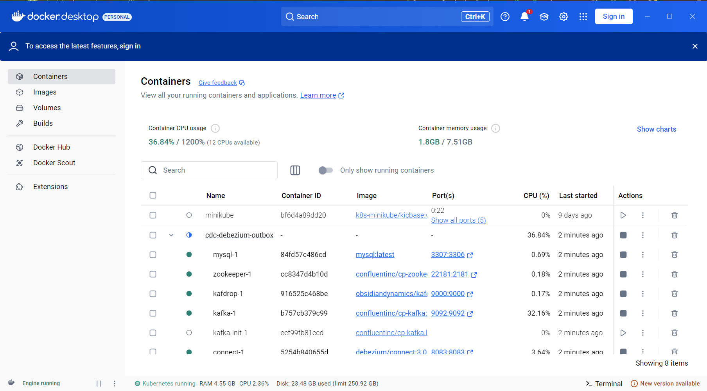
    <p> Figure 2 </p>
    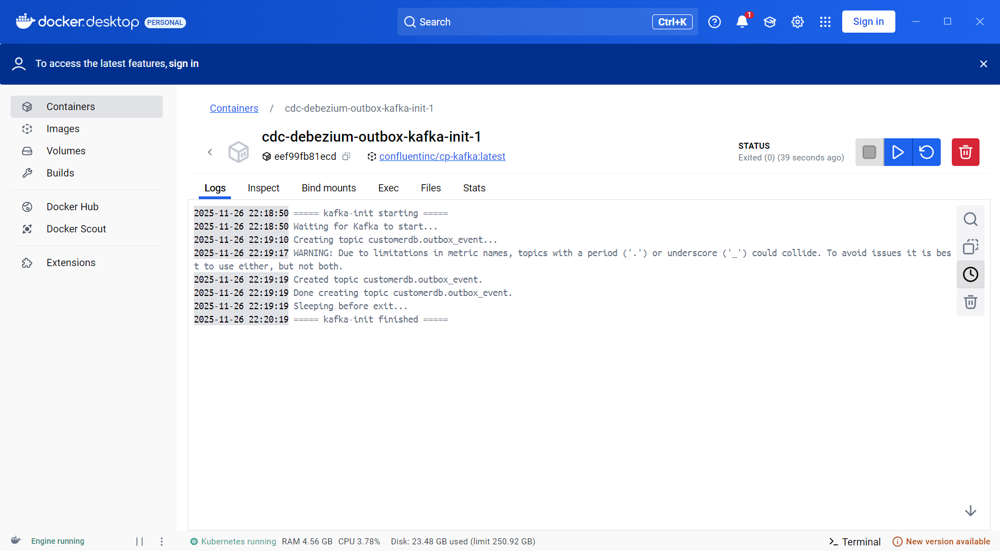
    <p> Figure 3 </p>
    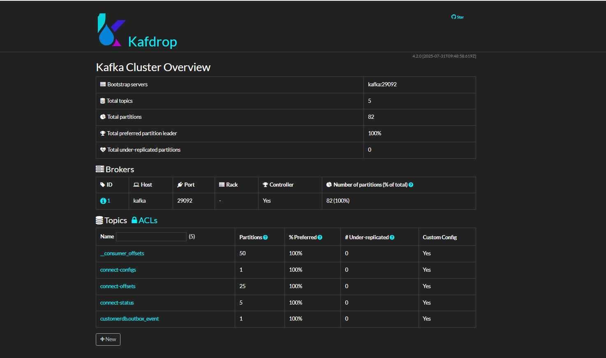
    <p> Figure 4 </p>
    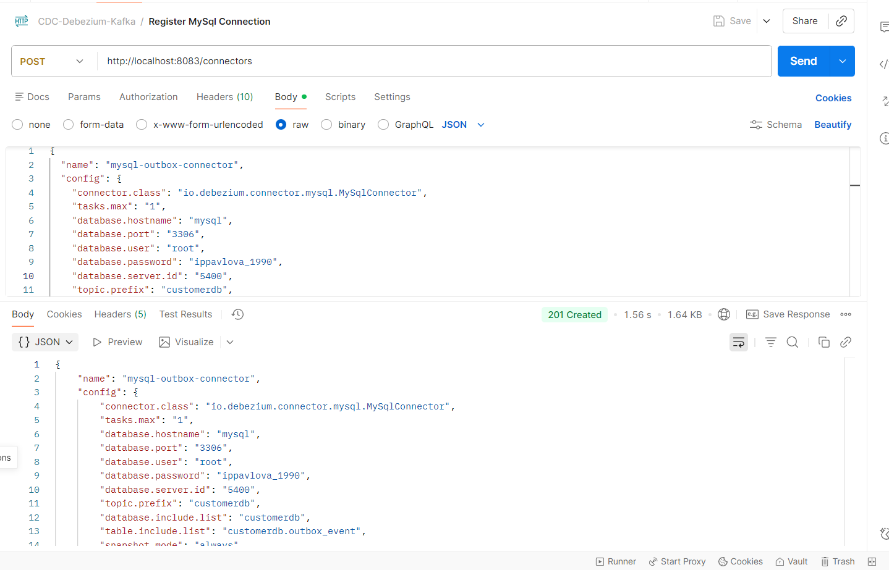
    <p> Figure 5 </p>
    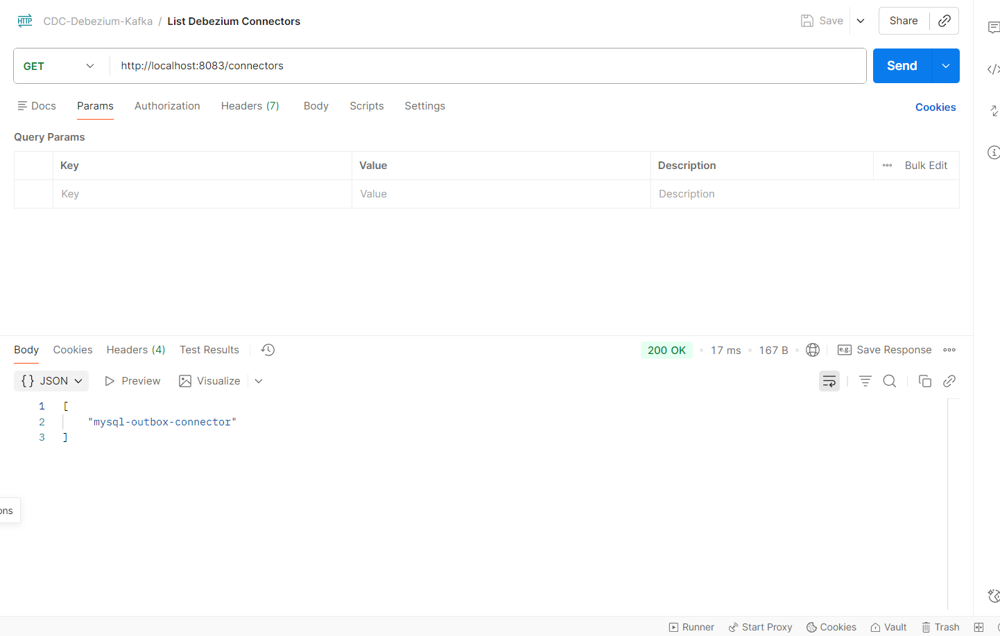
    <p> Figure 6 </p>
    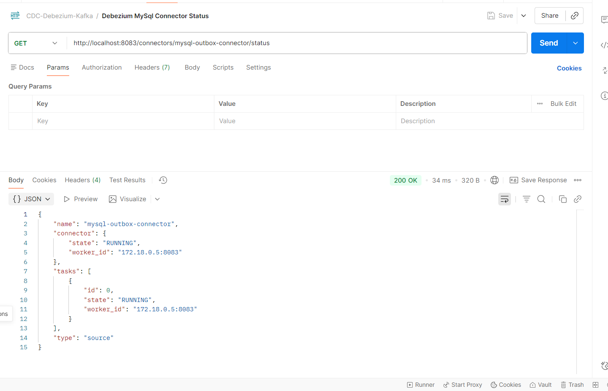
    <p> Figure 7 </p>
    
    <p> Figure 8 </p>
    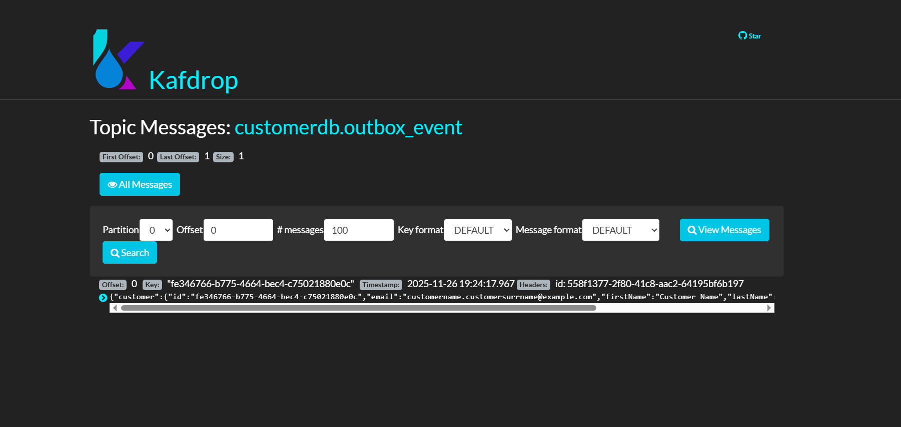
    <p> Figure 9 </p>
    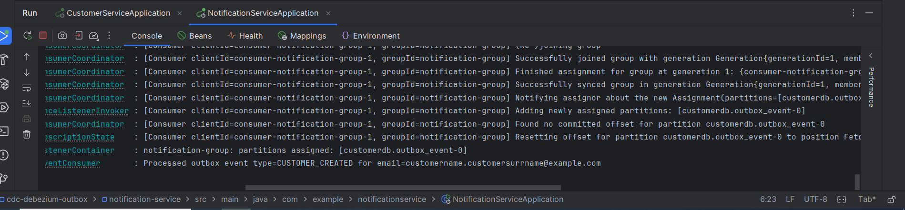
    <p> Figure 10 </p>
    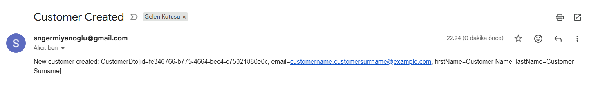
    <p> Figure 11 </p>
    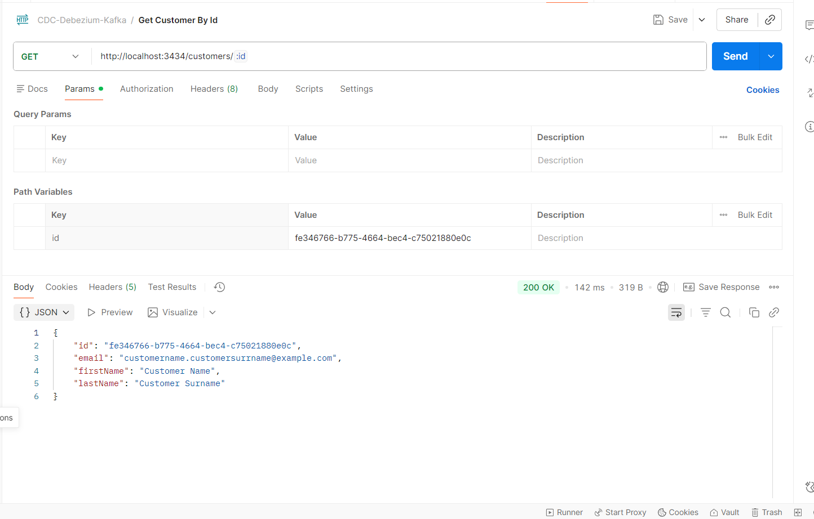
    <p> Figure 12 </p>
    
    <p> Figure 13 </p>
    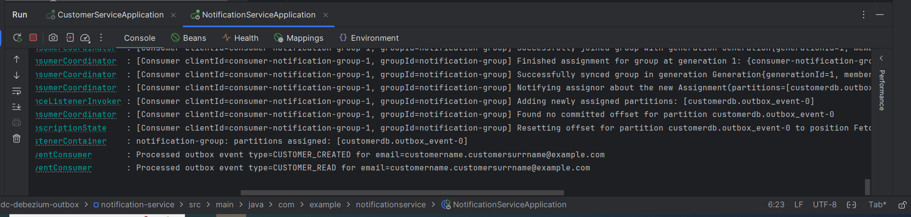
    <p> Figure 14 </p>
    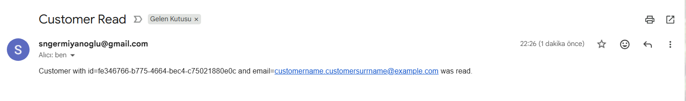
    <p> Figure 15 </p>
    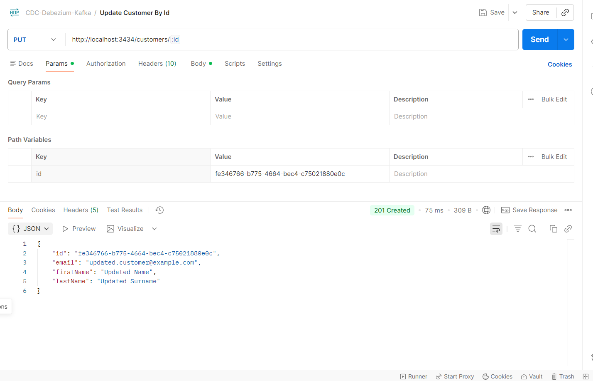
    <p> Figure 16 </p>
    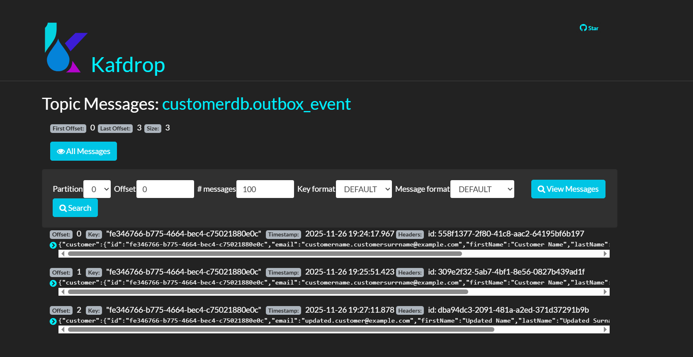
    <p> Figure 17 </p>
    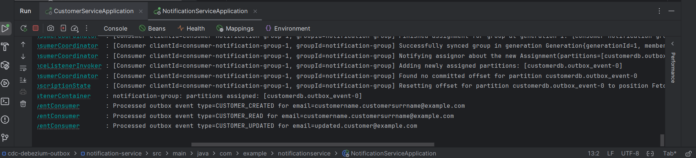
    <p> Figure 18 </p>
    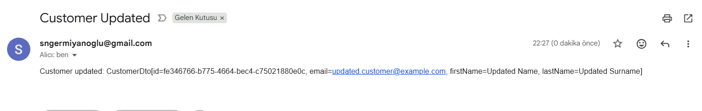
    <p> Figure 19 </p>
    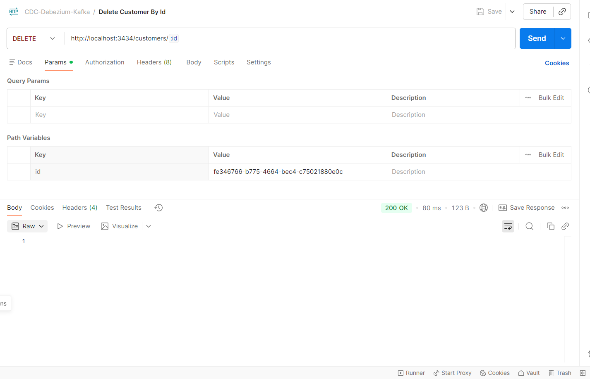
    <p> Figure 20 </p>
    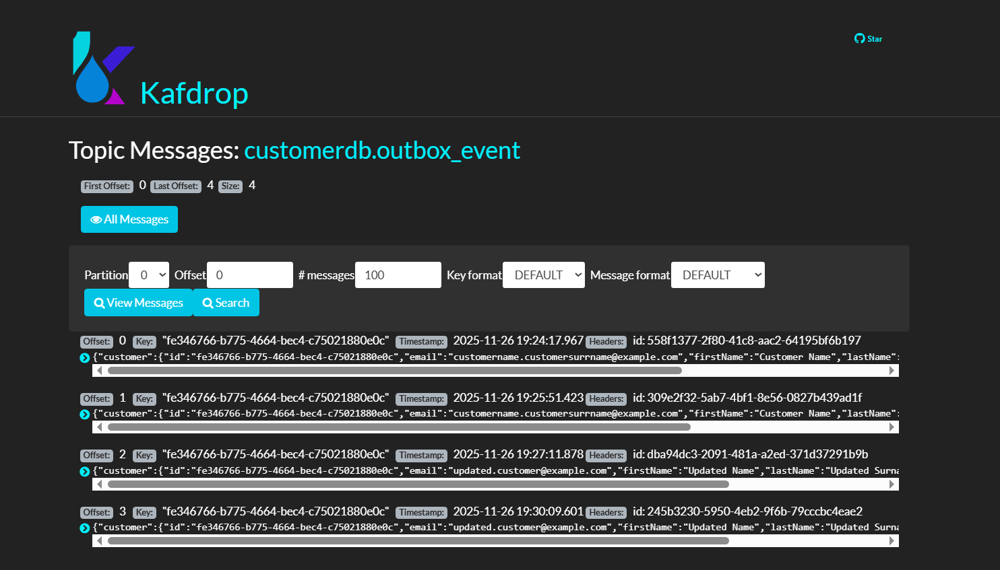
    <p> Figure 21 </p>
    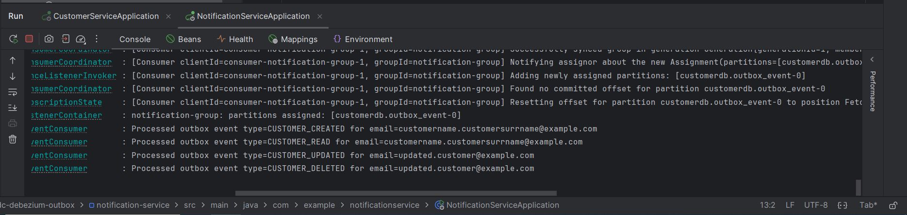
    <p> Figure 22 </p>
    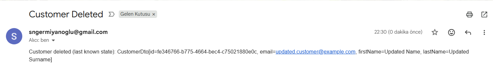
    <p> Figure 23 </p>
    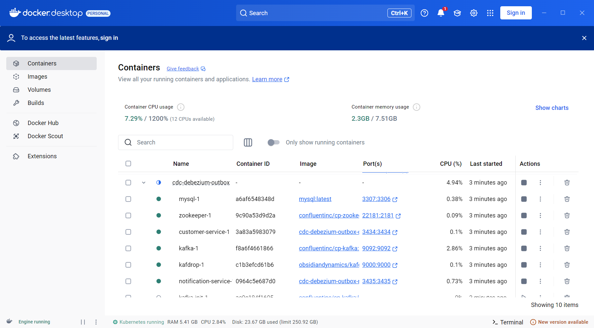
    <p> Figure 24 </p>
    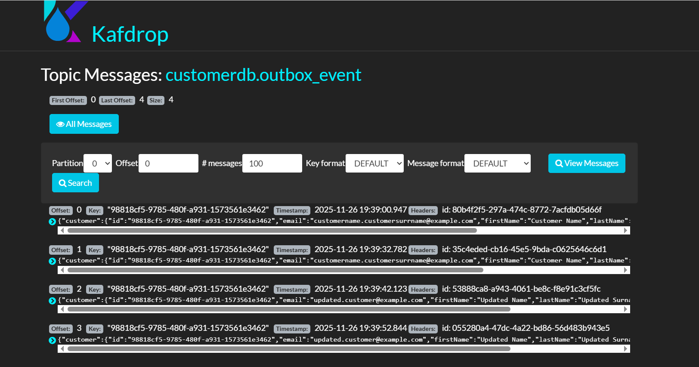
    <p> Figure 25 </p>
    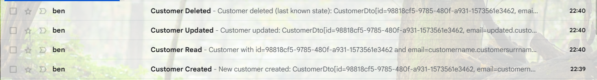
</details>

-----

### Contributors

- [Sercan Noyan Germiyanoğlu](https://github.com/Rapter1990)